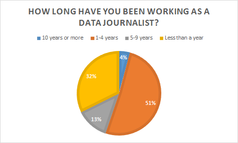
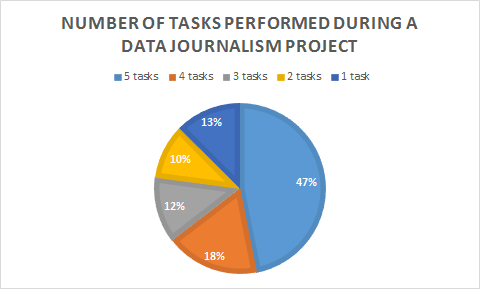
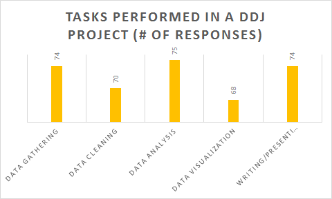
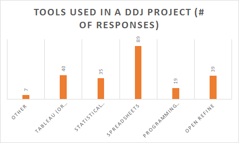
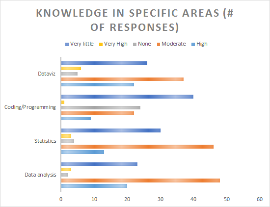
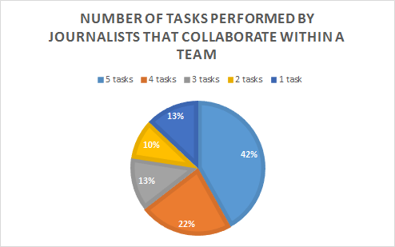
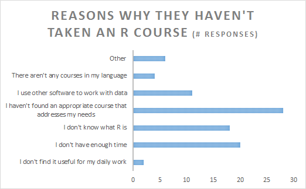

# R survey responses

** **

School of Data conducted a survey to identify the needs of data journalists in terms of learning how to use R.  In a period of two weeks, we received 97 responses. 

## Our audience

Half of the respondents (51%) are data journalists with between 1 and 4 years of experience, a third (32%) had less than a year's experience working in data journalism and 17% were journalists with 5 years or more in the field. 

   

Nevertheless, only 4 out of 10 work full time as data journalists in newsrooms, as freelancers or in other types of companies.  A third don’t consider data journalism their primary employment, and the rest are either students or work part-time. 

Most of the journalists (84%) work in media organisations (print, online, radio or TV), while the others do research or work in other types of organisations. 

In terms of the tasks they perform on a data journalism project, 47% of them go through the whole data pipeline: data gathering, cleaning, analysis, visualisation and storytelling.  

Data gathering, data analysis and writing the story are the most frequent tasks journalists perform in a project.  This suggests that they tend to perform multiple elements of the process, instead of focusing on a single component.  For our purposes, this means that a course that focuses on multiple skills rather than on a single process could be more appealing for the journalists.  

Additionally, most of the journalists (93%) use spreadsheets for their work and tools like Open Refine and Tableau.  The usage of statistical packages and programing languages is less frequent, but still significant; 36% and 20%, respectively.   This implies that there is a group of advanced users for whom it might be easier to learn R (if they don’t already use it).  

	
Regarding their knowledge of certain topics, half of the respondents have moderate expertise in data analysis and statistics but very little experience with programing.  Therefore, when designing an R course for this audience, the materials could focus more on the logic of R’s programing language and practical examples of it, rather than trying to teach basic statistical concepts using the software.  

Finally, 51% work within a team.  Of these, 63% said they collaborate to create data driven stories.  This collaboration happens across all the elements of the pipeline; rather than a member of the team being allocated an element each, the whole team collaborates on each component.  

On the other hand, 22% answered that their teammates do work with data, but in separate stories and 14% of these respondents told they are the only ones working with data. This reinforces the fact that data journalists have to know the whole data pipeline process and perform multiple tasks in their projects.  

## How do they learn?

### R courses

35% of the respondents had taken an R course before.  Of these, 70% had taken an online course and 64% managed to finish it.  Those that didn’t conclude the course cited the main reason as lack of time and also, that they didn’t find it useful for their work.  

Almost half the respondents that hadn’t taken an R course said the main reason for this was that they hadn’t found a course that addressed their specific needs.  This strengthens our main hypothesis: there is a need for learning materials, specially designed for journalists, that can help them not only learn a new tool, but teach them how they can apply it in their daily work. 

