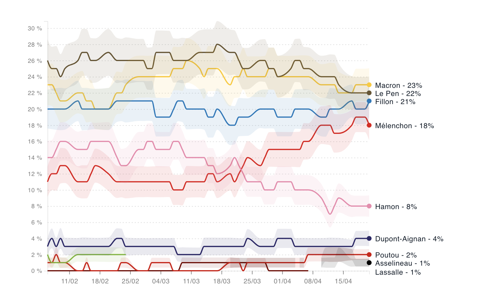
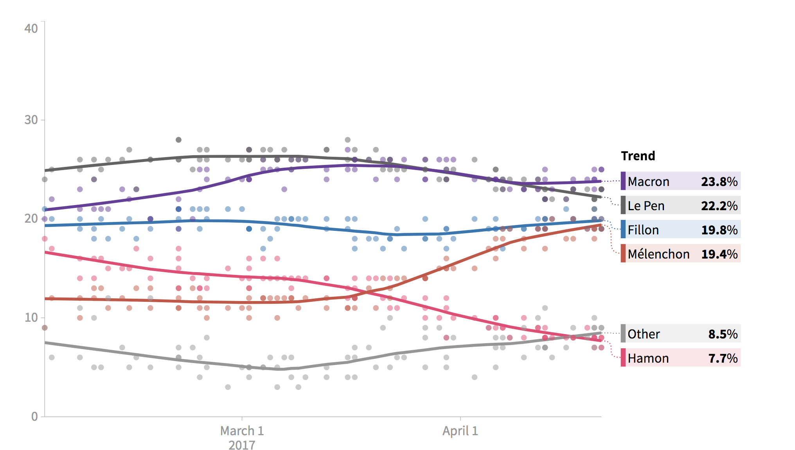
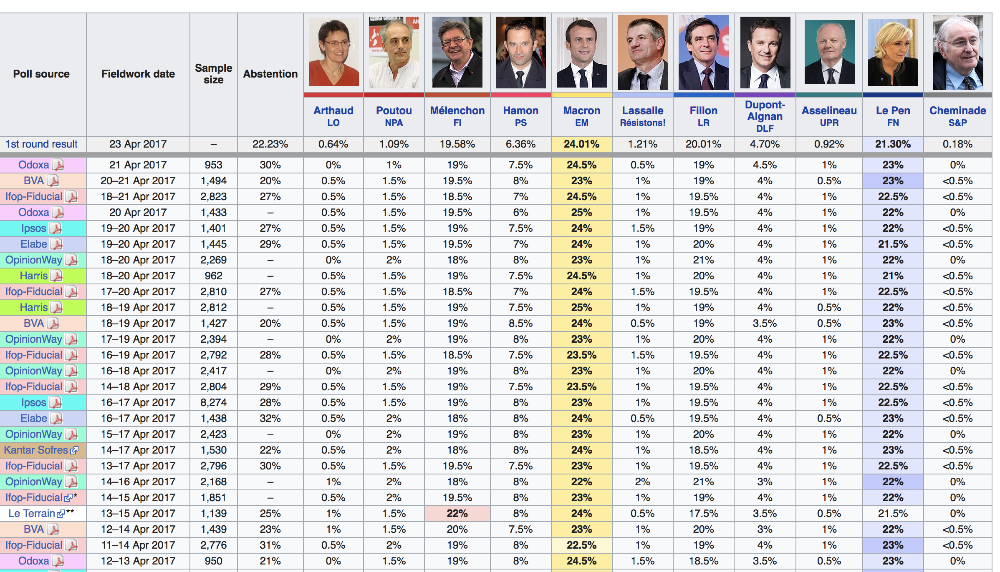

# Introduction 
---
# DEFINE
Polls have become the main instrument to measure the pulse of an electoral campaign. They work somehow like weather predictions: the closer we get from the moment we are trying to forecast, the more precise they become. But they can also be misleading, think in 2016 about the Brexit referendum or the Trump unpredicted election. 

Therefore, polls can give you blurring signals, information that can confuse the voter or the analyst. This is especially true during the campaign itself when journalists report every day several new polls with sometimes conflicting conclusions. For instance, in the US, during the presidential campaign, [RealClearPolitics](https://www.realclearpolitics.com/epolls/latest_polls/president/) referenced about 30 new polls a day. 

In this complex landscape, visualisations can bring some clarity and help citizens understand the larger trends beyond each poll. During the French presidential campaign, several news websites have produced data visualisations to show the trends behind all the polls produced daily by the main polling institutes. For instance, [LeMonde](http://abonnes.lemonde.fr/election-presidentielle-2017/visuel/2017/04/12/que-disent-les-sondages-de-la-presidentielle-2017_5110324_4854003.html) produced this lign graph with a background showing the variation between polling institutes and the larger trends of intentions of the electorate. 

The [Huffington Post](http://elections.huffingtonpost.com/pollster/france-presidential-election-round-1) has produced a similar visualisation with dots for each data point in a poll and a trend line. 

As this visualisation is very useful to understand the trend in an election, as journalists, we want to be able to produce this graph and adapt it to other contexts than the French election. 
This is what we'll do in this recipe! We'll show you step by step how to produce the above visualisations.


---
# FIND

To find that data, a journalist may want to report in a spreadsheet every new poll published but this might reveal quite burdersome. But, fortunately, for us, the Wikipedia community has done a truly amazing work in reporting every new poll in a single page with a normalized template during the primary elections and the Presidential campaign on both the first and second rounds.

Even better, there is an [entire category dedicated to opinion polling for elections](https://en.wikipedia.org/wiki/Category:Opinion_polling_for_elections) in which you can find opinion polling data for elections in the UK, Poland, Peru, Kenya, India, Iran… This a global effort to put opinion polling in perspective. 


You don't see the election going on in your country? Why don't you start reporting the latest opinion polls on Wikipedia? It's easy to do, very useful for the public and we might get help for other Wikipedia contributors.  

---
# GET

Now that we know where we can find the data, we need to actually be able to use it. Note that the data is on a webpage which means you need to extract that data from the webpage to a dataset. 

One straightforward way would be to simply copy the table to a spreadsheet. This actually works: 


But, while this approach is convinient when the campaign is over, this can be overwhelming in an ongoing race. As a journalist, whenever you want to update your graph, you will need to redo the whole process outside of R and import back the data. 

An alternative way would be to practice web scrapping which is the fancy name data scientists gave to extracting data from websites. R Studio has developed a package named `rvest` which allows users to extract data from a webpage and import them directly in a dataframe. So let's install and launch this package! 
```{r}
install.packages("rvest")
library(rvest)
```

Ok! So the first thing with `rvest`is to import the whole html page in which your data is nested. This is done using `<-`as an assignment operator like you do when you generally import data in R and with the `read_html` which obviously reads the html source when you specify a URL.   
```{r}
polls <- read_html("https://en.wikipedia.org/wiki/Opinion_polling_for_the_French_presidential_election,_2017")
```

Right now, the entire source code of the Wikipedia page on the French presidential election is currently imported in R. But, in this visualisation, we will focus on the first round data similary to what LeMonde and the Huffington Post have done above. This is still done using the `rvest` package with its `html_node` fonction which allows you to easily extract pieces out of HTML documents using Xpath (a query language for selecting nodes from an XML document such as a webpage) and CSS selectors (a way of targeting  specific HTML elements based on the specific CSS styling applied to them). 

To identify the Xpath, you can install a Chrome extension named [SelectorGadget](http://selectorgadget.com/) which will help know the Xpath and the CSS selector for the specific element we want to extract.

But there's an ever easier way, you can just use your browser. Right click on the table you want to extract (for us the first round opinion polls with verified candidates, those who were admitted to run) and select Inspect in Chrome or Examine in Firefox. Below, we will see the elements in which the table is nested in the HTML source code. Select `table.wikitable` which contains the entire table. This will select a line in blue in the source code: right click on it, select copy and copy selector. 


You should get the following CSS selector : `#mw-content-text > div > table:nth-child(66)`. Note that this might change if the page structure is updated.

Then you will need to tell `rvest` your discovery by reporting the CSS in the `html_node` fonction which extracts specific elements defined by their position. The `html_table` fonction will import that data into a dataframe we will name `polls_round1`. 

```{r}
library(tidyverse)
polls_round1 <- polls %>% 
  html_node("#mw-content-text > div > table:nth-child(66)") %>% 
  html_table(header = TRUE,fill=TRUE)  #header=TRUE uses the first row as a header and fill=TRUE automatically fills rows with NAs when there is fewer than the maximum number of columns.  
```


---
# Verify
It's always important to check the quality of the data. In this exemple, questions you can ask yourself can be: who are the listed polling institutions? What is the founding source of these polls? What are the polling methods? Is the sample sufficient to represent the country population? 

---
# Clean
Once you have checked the quality of the data, you will need to clean it before using them. Let's have a look at `polls_round1`, the data frame containing the polls results. You can see that the first four rows are redundant with the colomn header and the last row contains methodological information. Let's see remove that to make the data processable by creating a vector,a sequence of data elements, with `c` and removing it with `-` :
```{r}
polls_round1 <- polls_round1[-c(1,2, 3, 4, 5, 94), ] 
```
This is better but we lost column names. So let's rename all columnn names by using the `colnames` fonctions. 
```{r}
colnames(polls_round1) <- c("Poll source","Fieldwork date", "Sample size", "Abstention", "Arthaud", "Poutou", "Melenchon", "Hamon", "Macron", "Lassalle","Fillon", "Dupont-Aignan", "Asselineau","Le Pen", "Cheminade") #enlever les partis des noms de colonnes
```
Let's look again at our dataframe in the "environment" section of R Studio. If you look at the values for each candidates (Arthaud, Lassalle or Macron for instance), you will see `chr` which means that it's a chain of character for R. This means it is not considered as figures. The reason is we still have percentages which it does not process so let's remove them. 

To do this, we will use `mutate_at` which is [one of the verbs in `dplyr`](https://www.rstudio.com/wp-content/uploads/2015/02/data-wrangling-cheatsheet.pdf) to wrangle with the data. We will use `vars`to include the columns containing data for abstention and each candidate then we call the function `pars_number` by using `funs` to keep only what's before the percentage. Finally, we will record that data back in `polls_round1`. 
```{r}
polls_round1 <- polls_round1 %>% mutate_at(vars(`Arthaud`:`Cheminade`),funs(parse_number),na=character()) #enlever les pourcentages et absention 0
```

```{r}
#install.packages("lubridate")
#install.packages("rex")
library(lubridate)
library(rex)
rex_mode() #charge les éléments de rex en mémoire (voir aide)
get_date <- rex( #produit la regex à partir d'un langage lisible et compréhensible
  maybe(numbers %>% between(1,2), #pas obligé de l'avoir, peut etre entre un et deux nombres puis un tiret
  "–"),
  capture(
    name = "date", #groupe qu'on veut récupérer
    numbers %>% between(1,2), #entre un et deux nombres
    space, #puis un espace
    letters %>% n_times(3), #3 lettres pour le mois 
    space, 
    "20", one_of(1:5), number #année
  )
)

date <-re_matches(polls_round1$`Fieldwork date`, get_date)$date #crée le vecteur date

polls_round1<- polls_round1 %>% 
  mutate(date = date %>% dmy()) #ajoute la colonne

polls_round1_long <- polls_round1 %>% gather(Candidates, Percentage, Abstention:Cheminade) #gather

save(polls_round1_long, file = "./polls_round1_long.Rdata")

```


---
# Visualize 
```{r}
#devtools::install_github("hrbrmstr/hrbrthemes")
library(hrbrthemes)

polls_round1_long %>% 
  filter(polls_round1_long$Candidates!="Abstention") %>% 
  ggplot() +
  geom_point(mapping = aes(x=date,y=Percentage,color = Candidates, alpha = "0.7")) + # 
  geom_smooth(aes(date,y=Percentage,color = Candidates))+ 
  labs(x = "Date of poll",
       y = "Percentage of candidate in poll",
       title = "Polls during the 2017 Presidential election in France",
       subtitle = "Evolution of polls during the month preceding the first round of the 2017 Presidential election in France",
       caption = "Source : Wikipedia")+
  theme_ipsum() +
  theme(legend.position="right") #reminder, keep track: do it after +
```
--- 
# Present
Maybe we can make it interactive?
